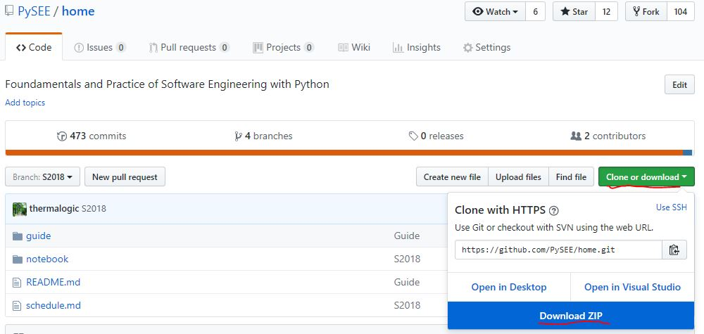

# Foundamentals and Practice of Software Engineering with Python

* If you have concerns about the course, please email to me or open [the github issue](https://github.com/PySEE/home/issues). I value all suggestions.
 
    * Email: cmh@seu.edu.cn. 

##  Goal

This course is intended to train **students majored in thermal energy engineering** in good software skills for producing code and documentation.

We will cover: 

* writing clean, testable, high quality code in Python
* interactive analysis and literate programming with the IPython Notebook
* a useful set of algorithmic and problem reduction techniques
* computational tools to model and understand data(numpy, matplotlib, scipy)
* how to determine which data structure is the most appropriate for solving the problem 
* debug programs using a standardized approach
* write unit tests and evaluate software quality
* use version control 
* C/C++ progamming with GCC

### Required Materials and Textbooks

* A laptop computer will be needed in the classroom.

* John V. Guttag. Introduction to Computation and Programming Using Python. Revised and expanded edition. MIT Press. 2013.08.  

   * https://mitpress.mit.edu/index.php?q=books/introduction-computation-and-programming-using-python-0

   * 梁杰译. 编程导论. 人民邮电出版社(第1版) .  2015.03

   * Accompanying Python3 Code：https://mitpress.mit.edu/sites/all/modules/patched/pubdlcnt/pubdlcnt.php?file=/sites/default/files/code-978-0-262-52962-4_0.zip&nid=321887

* Python 3 documentation. https://docs.python.org/3/

* Lectures on scientific computing with python https://github.com/jrjohansson/scientific-python-lectures

* Michael J . Mora. Fundamentals of Engineering Thermodynamics(7th Edition). John Wiley & Sons, Inc. 2011

## Contents

* [Lectures in Jupyter notebook](https://github.com/PySEE/home/tree/S2017/notebook)

   Please install Jupyter to read and interactive with the notebook.

   Online read-only versions：

   http://nbviewer.ipython.org/github/PySEE/home/tree/S2017/notebook/
 
* [Guide](https://github.com/PySEE/home/tree/S2017/guide)

   1. [Python学习和开发环境的建立(教学版).docx](https://github.com/PySEE/home/tree/S2017/guide/Python学习和开发环境的建立(教学版).docx)
   
   2. [Markdown](https://github.com/PySEE/home/tree/S2017/guide/Markdown.md)

   3. [Version Control and GitHub](https://github.com/PySEE/home/tree/S2017/guide/VersionControlAndGitHub.md)

   4. [C/C++ Programming With GCC](https://github.com/PySEE/home/tree/S2017/guide/ProgrammingWithGCC.md)

   5. [Ubuntu,Python,C/C++](https://github.com/PySEE/home/tree/S2017/guide/Ubuntu-Python-C.md)
   
* [Practices(60)](https://github.com/PySEE/RecommendedPractices/tree/S2017/)
    
   *  Please Visit **RecommendedPractices** for details: https://github.com/PySEE/RecommendedPractices/

   1. **Github**(5)：[Github、Git](https://github.com/PySEE/RecommendedPractices/tree/S2017/P1)

   2. **Python**(15)：[Python、IDE](https://github.com/PySEE/RecommendedPractices/tree/S2017/P2)
   
   3. **Interactive Computing**(15)： [Jupyter Notebook of the Rankine cycle](https://github.com/PySEE/RecommendedPractices/tree/S2017/P3)  
    
   4.  **Data Analysis**(15)：[Statistics, regression and visualization](https://github.com/PySEE/RecommendedPractices/tree/S2017/P4)

   5.  **Unit Test**(10)：[IAPWS-IF97 physical properties calculation and unit test](https://github.com/PySEE/RecommendedPractices/tree/S2017/P5)

   *  **Bonus Points**(+5): [C/C++ Programming with GCC，Ubuntu](https://github.com/PySEE/RecommendedPractices/tree/S2017/Bonus) 

## Course Grades

The Course graded on an 100 point scale and then weighted according to the following distribution:

  * In-class Exercises 20%
  * Practice (~5) 60%,  Bonus Points: +5
  * Final Exam 20%

# Update Course

This repository contain all files of the course. You can manually download these files, 



but we recommend that you use [git](https://git-scm.com/downloads) to **clone** and **update** this repository.

You can use any GUI git client to update this repository, for example: [GitHub Desktop](https://desktop.github.com/),  [EGit](http://www.eclipse.org/),  [VS Code](https://code.visualstudio.com/).

You may also use the following commands if you have installed [git](https://github.com/git-for-windows/git/releases):

## Cloning to Your Computer

When you clone a repository you set up a copy on your computer. Run:

```bash
git clone https://github.com/PySEE/home.git
```

This will create a folder **home** on your computer, with the files in subdirectories.

## Updating to The Latest Version

As we release new files, or if we update an already released files, you'll have to update your repository.

You can do this by changing into the **home** directory and executing:

```bash
git pull
```
That's it - you'll have the latest version of the repository.

# Softwares for the Course

* Python3:  https://www.python.org/downloads/
* Python Packages
  * Scipy for Windows:  http://www.lfd.uci.edu/~gohlke/pythonlibs/ 
  * Jupyter: http://jupyter.org/
     ```
         >pip install jupyter
     ```
  * IAPWS-IF97:
     * https://github.com/PySEE/SEUIF97
     * https://github.com/jjgomera/iapws
      ```
          >pip install iapws
      ```
* Eclipse IDE
  * Java JDK: http://www.oracle.com/technetwork/java/javase/downloads/index.html
  * Eclipse CDT: http://www.eclipse.org/
  * Pydev: http://pydev.org/
* Visual Studio Code：https://code.visualstudio.com/
* Git for Windows.  https://github.com/git-for-windows/git/releases
* MinGW-W64 (GCC) Compiler Suite: https://sourceforge.net/projects/mingw-w64/files/

## TIPS

We highly recommend you practice coding whenever you have a few minutes.

Even if you are just modifying available code, it will be incredibly beneficial.

You **NEED** to **get your hands dirty** and **practice**

