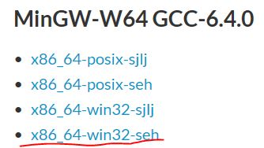

# Development Environment

## A  Windows10：

  Windows10 64

* 1 Southeast University

  * January 2015, Southeast University and Microsoft Corp provide legitimate Windows, Office for the staffs and students.

  http://nic.seu.edu.cn/2015/0113/c12333a115289/page.htm
  
* 2 Microsoft
  
   * https://www.microsoft.com/en-gb/software-download/windows10
     * Do you want to install Windows 10 on your PC?
       
       download and run the media creation tool: 
       https://go.microsoft.com/fwlink/?LinkId=691209
 
## B Development tools and packages

* 1 Python3:  https://www.python.org/downloads/

* 2 Python Packages

  * 2.1 Jupyter: http://jupyter.org/

  * 2.2 Numpy、Scipy and Matplotlib for Windows:  http://www.lfd.uci.edu/~gohlke/pythonlibs/ 

  * 2.3 IAPWS-IF97:

     * https://github.com/PySEE/EDUIF97

     * https://github.com/jjgomera/iapws
 
* 3 Visual Studio Code：https://code.visualstudio.com/

* 4 Git for Windows.  https://github.com/git-for-windows/git/releases

* 5 MinGW-W64(GCC) Compiler Suite: https://sourceforge.net/projects/mingw-w64/files/

## C Set up your development environment

### 1 安装Python3.5
    
* 从Python官网下载Windows 64位Python3.5.2：  https://www.python.org/downloads/

  * 定制方式安装: 
      
      1) 安装软件到目录： C:\python35
            
      2) 勾选“Add Python3.5 to Path” 


   
* 更新pip到新版本:DOS命令行下
```bash
  >python -m pip install -U pip
```

### 2 安装Jupyter Notebook

* 安装：命令行

```bash       
    >pip install jupyter
```      

* 启动Jupyter notebook： 命令行

```bash       
    >jupyter notebook     
```

* 使用某文件夹为Jupyter Notebook工作目录：在该文件夹下启动Jupyter Notebook服务，存放用Jupyter Notebook建立的项目文件。

* 快速启动Jupyter Notebook：

  用"记事本"(Notebook),新建一空白纯文本文档，输入内容"jupyter notebook"

  将文本文件另存为批处理文件（文件类型选择"所有文件"、用".bat"后缀），文件名自定：如"start.bat"， 保存到指定的Jupyter Notebook工作目录文件夹中

  双击"start.bat"文件，启动Jupyter Notebook 

### 3 科学计算包 
   
    numpy,scipy, matplotlib

从  http://www.lfd.uci.edu/~gohlke/pythonlibs/ 下载和Python和Windows版本对应的whl, 然后,pip命令安装（*指下载的软件包名）

```bash       
  >pip install *.whl
```       

Python3.5，Windows10 64位对应的包

```bash
  >pip install numpy‑1.13.3+mkl‑cp35‑cp35m‑win_amd64.whl
  >pip install scipy‑1.0.0‑cp35‑cp35m‑win_amd64.whl
  >pip install matplotlib‑2.1.0‑cp35‑cp35m‑win_amd64.whl
```

### 4 IAPWS-IF97物性计算

* 4.1 Python版IAPWS-IF97

   需要预先安装好numpy和scipy

```bash       
   > pip install iapws
``` 

* 4.2 共享库IAPWS-IF97

从github的课程仓库：https://github.com/PySEE/SEUIF97 下载仓库zip文件


   
*  解压下载的zip文件，然后：
   
   * 1) 将libseuif97.dll拷贝到 c:\windows\system
   * 2) 将seuif97.py拷贝到python安装目录的lib子目录下，如C:\python35\Lib
 
### 5 Visual Studio Code

Visual Studio Code is a lightweight but powerful source code editor which runs on your desktop and is available for Windows, macOS and Linux. It comes with built-in support for JavaScript, TypeScript and Node.js and has a rich ecosystem of extensions for other languages (such as C++, C#, Python, PHP, Go) and runtimes (such as .NET and Unity). 

* 1  Download and Installl Visual Studio Code 
 
    https://code.visualstudio.com/

* 2 Install Python Extension

    https://code.visualstudio.com/docs/languages/python

* 3 Install the Microsoft C/C++ extension

    https://code.visualstudio.com/docs/languages/cpp

### 6  Version control with GIT

* Git for Windows.  https://github.com/git-for-windows/git/releases

### 7 MinGW-W64 (GCC) Compiler Suite

  * 1. Goto MinGW mother site at https://sourceforge.net/projects/mingw-w64/files/?source=navbar

      Downloads x86_64-6.3.0-release-win32-sjlj or seh
     
     sjlj: 32 and 64 bits,but it incurs a minor 
     performance penalty
     
     seh：64 bits only
  
  

  * 2. unzip the ziped MinGW-w64 to C:\mingw64

  * 3. Add C:\mingw64\bin to the environment variable PATH

    To set an environment variable permanently in Windows: (so that it is available to all the Windows' processes)

    start the "Control Panel" ⇒ "System" ⇒ "Advanced system settings" ⇒ Switch to >"Advanced" tab ⇒ "Environment variables" ⇒ Choose "System Variables" (for all users) or "User >Variables" (for this login user only) ⇒ Choose "Edit" (for modifying an existing variable) or >"New" (to create a new variable) ⇒ Enter the variable "Name" and "Value".

  * 4. Verify the GCC installation by listing the version of gcc, g++ and gdb:
  ```bash
  > gcc --version
  > g++ --version
  > gdb --version
  ``` 

## D 使用课件

 预先安装好Python和Jupyter Notebook
 
* 从github下载课程home仓库zip文件: https://github.com/PySEE/home


* 启动课程Jupyter Notebook
 
  解压下载的 zip 文件,运行notebook子目录下的批处理文件: **StartNB.bat**，启动课程Jupyter Notebook服务

## References

* Guido van Rossum. Python Tutorial. https://docs.python.org/3/tutorial/index.html

* Jupyter：http://jupyter.org/

    * Documentation. http://jupyter.readthedocs.org/en/latest/

* Scipy. http://www.scipy.org/

* Numpy. http://www.numpy.org/
  
* Matplotlib.  http://matplotlib.org/

* Visual Studio Code: https://code.visualstudio.com/
  
   * Documentation: https://code.visualstudio.com/docs

   * Getting Started with Python https://code.visualstudio.com/docs/python/python-tutorial

   * Git Version Control in VS Code：https://code.visualstudio.com/docs/editor/versioncontrol

   * C/C++ for VS Code： https://code.visualstudio.com/docs/languages/cpp

* GCC, the GNU Compiler Collection：http://gcc.gnu.org/

   * GCC for Windows 64 & 32 bits：http://mingw-w64.org/

   * GCC and Make：Compiling, Linking and Building C/C++ Applications http://www3.ntu.edu.sg/home/ehchua/programming/cpp/gcc_make.html