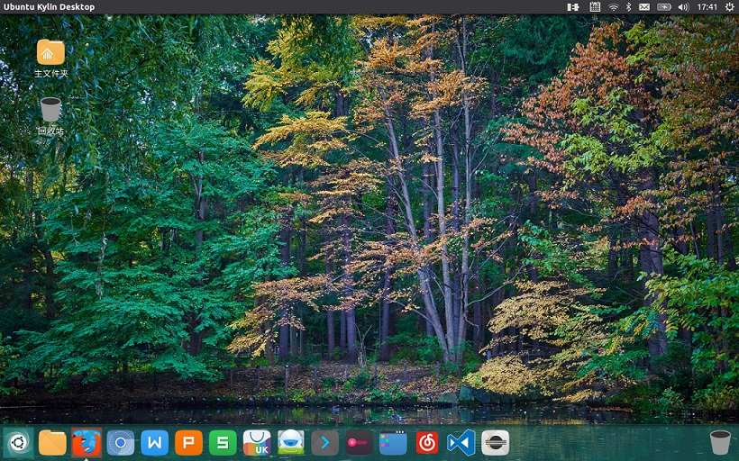

# Ubuntu系统安装和Python,C/C++开发环境的建立

Windows是同学们的主要工作环境，已安装Windows系统的电脑上，双系统是Ubuntu适当的安装模式。
   
## Windows环境硬盘空间要求


  安装前，在Windows环境下，从空余的硬盘空间中划出一个空的独立分区，给Ubuntu使用。

  安装空间10G就够了。为了以后工作方便，更大些为好，如：50G


## 安装Ubuntu

Ubuntu发行版很多，建议使用“中国味”的UbuntuKylin 16.04 LTS版。

从UbuntuKylin官网 http://www.ubuntukylin.com/  下载UbuntuKylin16.04 版iso,

 

从 http://www.pendrivelinux.com/universal-usb-installer-easy-as-1-2-3/ 下载Universal-USB-Installer制作U盘系统

然后，用U盘安装双系统。

安装过程，可参考：

* U盘安装Ubuntu 16.04 Beta2（与Win10双启动）

  * http://www.linuxdiyf.com/linux/19782.html

> 可选Linux系统: **Linux Mint Xfce**
>
>[Linux Mint Xfce Edition](https://www.linuxmint.com/)
>
>适用对象：要求更快的系统相应速度；硬件性能较弱的计算机。
>
>    系统安装后，需要补充安装中文包及其输入法(搜狗输入法)
>
> 

## 安装要点
* 1 Welcome界面：选择语言 **English**
* 2 Wireless界面：选择 不连接无线网络 
* 3 Preparing to install Ubuntu界面: 选择 安装第三方软件
* 4 Installation type界面: 选择 **something else**
   * 自定义系统分区和挂载点，简单可靠的方式如下：
       * /home： home挂载点和分区：从空闲空间中划分出一个“logic”分区， 作为 /home 挂载点
         * **注意**: 
           * 是 **“logic”** 分区，因为一个硬盘可划分的主分区数量有限；
           * 一定要有home挂载点和分区。如重新安装ubuntu， 仍将这个分区挂载在home下，不要格式化该分区，原来系统中的用户文件都能保留 
       * /： 系统挂载点和分区：将余下空闲空间都划 “/” 分区，作为系统挂载点。 如果重新安装其他版本Liunx，将这个分区格式化.
  * 分好区后，点安装
* 5 Where are you:选择时区为 **shanghai**
* 6 Who are you: 用户名和密码，选择自动登录（如重装系统且要使用原home分区,建议用原用户名）

> 可选系统安装方案：**安装Ubuntu到U盘**
>
> 安装Ubuntu到U盘的步骤和安装到计算机硬盘分区一样
>
>不同的只是安装 **“位置”**：1）选择U盘为boot loader设备； 2）Ubuntu各分区挂载到U盘
>
> 网络上相关文档很多，可查询。

## Version Control: Git

```bash 
   $sudo apt install git
```

##  C/C++ With GCC

    Ubuntu系统内置GCC编译器，无需安装

## Python3开发环境

Ubuntu系统中同时安装有Python2.7和Python3,   Python3相关命令都加3，如：

```bash
    $python3 
    $idle3
    $pip3
```

Ubuntu系统Python3中不完整，需补充: pip3、idle3。

在线安装：
```bash
    $sudo apt install python3-pip
    $sudo -H python3 -m  pip install  --upgrade pip 
    $sudo apt install idle3
```

### 安装scipy

apt在线安装
```bash
$sudo apt install python3-numpy python3-scipy python3-matplotlib
```

### 安装Jupyter

pip3在线安装
 
```bash
$sudo –H pip3 install jupyter
```

### 安装IAPWS

```bash
$sudo –H pip3 install iapws
```

### 安装SEUIF97

Download ziped file from : https://github.com/thermalogic/SEUIF97 unzip, then 

1.copy libseuif97.so to a default path of Linux shared lib
```bash
   $sudo cp libseuif97.so /usr/lib/
```

2.copy seuif97.py to a default path of Python lib
```bash  
   $sudo cp seuif97.py /usr/lib/python3.5/
```

## Visual Studio Code开发环境

From   https://code.visualstudio.com/docs/?dv=linux64_deb  downloan VS Code for Debian,Ubuntu

```bash

$sudo dpkg -i [vscode filename].deb

```

2 Install Python Extension in  Visual Studio Code

    https://code.visualstudio.com/docs/languages/python

3 Install the Microsoft C/C++ extension

    https://code.visualstudio.com/docs/languages/cpp

4 set Python3 as the default Python Version

>```
> // Path to Python, you can use a custom version of Python by modifying this setting to include the full path.
>  "python.pythonPath": "python3",
>```

## Reference

* Linux Mint Guide(中文版） https://linuxmint.com/documentation/user-guide/Cinnamon/chinese_16.0.pdf

* Unix Survival Guide http://www3.ntu.edu.sg/home/ehchua/programming/howto/Unix_SurvivalGuide.html

* Ubuntu Howto http://www3.ntu.edu.sg/home/ehchua/programming/howto/Ubuntu_HowTo.html